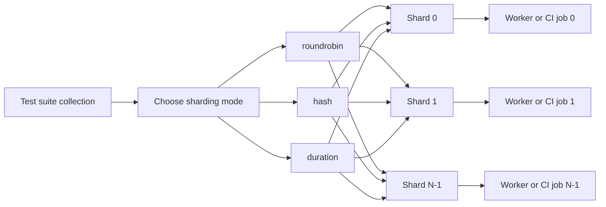

[](https://badge.fury.io/py/pytest-shard-cloudc)

[繁體中文](README.zh-TW.md) | **English**

# pytest-shard

> **This is a fork of [AdamGleave/pytest-shard](https://github.com/AdamGleave/pytest-shard) by [Cloud Chen](https://github.com/wolke1007).**
> Modifications include: Allure report integration, multi-shard result merging, nox-based tooling, and modernized packaging with `pyproject.toml`.

`pytest-shard` splits your test suite across multiple machines or CI workers at individual test-case granularity. By default it sorts tests by node ID and assigns them round-robin across shards, so parallelism works even when all tests live in a single file or a single parameterized method.

## How It Works



- `roundrobin`: sort by node ID, then assign by `index % num_shards`
- `hash`: assign by `SHA-256(node_id) % num_shards`
- `duration`: assign by LPT bin-packing using `.test_durations`

## What it does

| Capability | Description |
|------------|-------------|
| **Round-robin sharding** (default) | Sorts tests by node ID and interleaves across shards, guaranteeing shard counts differ by at most 1 |
| **Hash-based sharding** | Assigns each test deterministically via `SHA-256(node_id) % N` — per-test stable even as the suite grows |
| **Duration-based sharding** | Greedy bin-packing using a `.test_durations` file (compatible with pytest-split) to minimise the longest shard |
| **Zero configuration** | Just add `--shard-id` and `--num-shards` — no config files, no test ordering required |
| **Any granularity** | Splits at the individual test level, not at the file or class level |
| **CI-agnostic** | Works with GitHub Actions, CircleCI, Travis CI, or any system that runs parallel jobs |
| **Allure integration** | Collect results per shard, merge them, and view a unified Timeline report |

## Documentation

| Guide | Description |
|-------|-------------|
| [Sharding Modes](doc/sharding-modes.md) | Detailed behavior of `roundrobin`, `hash`, and `duration`, including `.test_durations`, verbose shard reports, and mode selection guidance. |
| [Demo Sessions](doc/demo-sessions.md) | How contributors can run the bundled demo suites locally with `nox`. |
| [Allure Report Integration](doc/allure-integration.md) | How to collect Allure results across shards, merge them into one report, run shards in parallel locally, and integrate with GitHub Actions / CircleCI. Includes a worked example with 30 tests across 3 parallel shards and a Timeline screenshot. |

## Quick start

### Installation

```bash
pip install pytest-shard-cloudc
```

### Split tests across N machines

```bash
# Machine 0
pytest --shard-id=0 --num-shards=3

# Machine 1
pytest --shard-id=1 --num-shards=3

# Machine 2
pytest --shard-id=2 --num-shards=3
```

Each machine runs roughly 1/N of the test suite. Together they cover 100% of tests.

### Choose a sharding mode

```bash
# Round-robin (default) — guaranteed count balance
pytest --shard-id=0 --num-shards=3 --shard-mode=roundrobin

# Hash — per-test stable assignment, stateless
pytest --shard-id=0 --num-shards=3 --shard-mode=hash

# Duration — bin-packing by recorded test times, minimises longest shard
pytest --shard-id=0 --num-shards=3 --shard-mode=duration --durations-path=.test_durations
```

See [Sharding Modes](doc/sharding-modes.md) for detailed trade-offs, `.test_durations` generation, and mode selection guidance.

### GitHub Actions example

```yaml
jobs:
  test:
    runs-on: ubuntu-latest
    strategy:
      matrix:
        shard_id: [0, 1, 2]
    steps:
      - uses: actions/checkout@v4
      - uses: actions/setup-python@v5
        with: { python-version: "3.11" }
      - run: pip install pytest-shard-cloudc
      - run: pytest --shard-id=${{ matrix.shard_id }} --num-shards=3
```

### CircleCI example

```yaml
jobs:
  test:
    parallelism: 3
    steps:
      - run: pytest --shard-id=${CIRCLE_NODE_INDEX} --num-shards=${CIRCLE_NODE_TOTAL}
```

## More guides

- For mode behavior, `.test_durations`, verbose shard reports, and selection strategy, see [Sharding Modes](doc/sharding-modes.md).
- For contributor-facing demo commands, see [Demo Sessions](doc/demo-sessions.md).
- For report generation and parallel execution screenshots, see [Allure Report Integration](doc/allure-integration.md).

## Alternatives

[pytest-xdist](https://github.com/pytest-dev/pytest-xdist) parallelizes tests across CPU cores on a single machine and supports remote workers. A common pattern is to combine both: use `pytest-shard` to split work across CI nodes, and `pytest-xdist` to parallelize within each node.

[pytest-circleci-parallelized](https://github.com/ryanwilsonperkin/pytest-circleci-parallelized) splits by test run time rather than test count, but only at class granularity and only for CircleCI.

## Contributions

Contributions are welcome. The package requires Python 3.11 or newer. Install the development toolchain and run the full check suite:

```bash
pip install -e .[dev]
nox
```

The Allure integration test also requires the `allure` CLI to be available on `PATH`.

## License

MIT licensed.

Original work Copyright 2019 Adam Gleave.
Modifications Copyright 2026 Cloud Chen.
