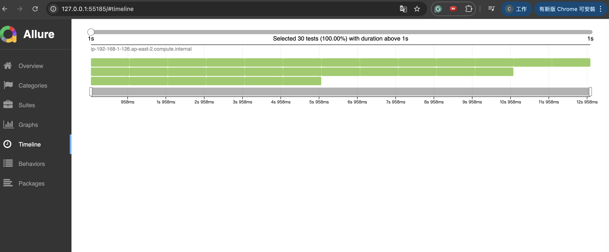
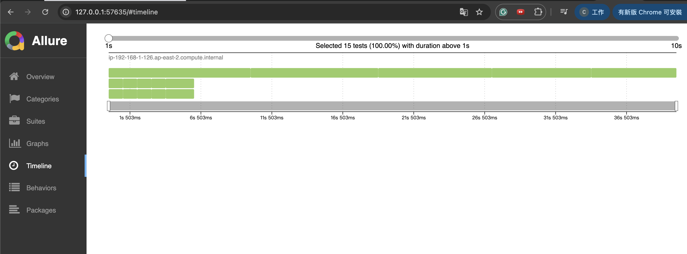
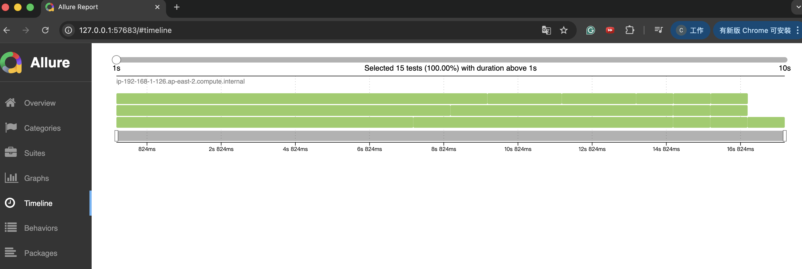

**繁體中文** | [English](allure-integration.md)

# pytest-shard 的 Allure Report 整合指南

本指南說明如何跨多個 shard 收集 [Allure](https://allurereport.org/) 測試結果、合併成單一報告，並驗證輸出內容，包含用於分析平行執行情況的 Timeline 視圖。

---

## 目錄

1. [前置需求](#前置需求)
2. [運作原理](#運作原理)
3. [逐步設定](#逐步設定)
   - [安裝相依套件](#1-安裝相依套件)
   - [各 shard 輸出 Allure 結果](#2-各-shard-輸出-allure-結果)
   - [合併結果並產生報告](#3-合併結果並產生報告)
4. [平行執行範例](#平行執行範例)
   - [Demo：30 個測試、3 個 shard](#demo30-個測試3-個-shard)
   - [以 nox 自動化](#以-nox-自動化)
   - [Timeline 結果](#timeline-結果)
5. [以執行時間平衡負載](#以執行時間平衡負載)
   - [問題：Round-Robin 造成執行時間不均](#問題round-robin-造成執行時間不均)
   - [解法：記錄執行時間，再重新分配](#解法記錄執行時間再重新分配)
   - [Demo：兩次執行的對比](#demo兩次執行的對比)
   - [Timeline 對比](#timeline-對比)
6. [CI/CD 整合](#cicd-整合)
   - [GitHub Actions](#github-actions)
   - [CircleCI](#circleci)
7. [疑難排解](#疑難排解)

---

## 前置需求

| 需求 | 版本 | 安裝方式 |
|------|------|----------|
| pytest-shard | ≥ 1.0.0 | `pip install pytest-shard-cloudc` |
| allure-pytest | ≥ 2.13 | `pip install allure-pytest` |
| Allure CLI | ≥ 2.20 | [Allure CLI 安裝指南](https://allurereport.org/docs/install/) |

---

## 運作原理

```
機器 / Worker 0                   機器 / Worker 1                   機器 / Worker N
─────────────────────             ─────────────────────             ─────────────────────
pytest --shard-id=0               pytest --shard-id=1               pytest --shard-id=N
      --num-shards=N                    --num-shards=N                    --num-shards=N
      --alluredir=results/shard-0       --alluredir=results/shard-1       --alluredir=results/shard-N
           │                                  │                                  │
           └──────────────────────────────────┴──────────────────────────────────┘
                                              │
                                   複製所有 *-result.json
                                   到 results/combined/
                                              │
                                   allure generate results/combined
                                              │
                                     allure-report/  ← 單一合併報告
```

**為何用複製而非直接指向多個目錄？**
`allure generate` 只接受一個來源目錄。由於 `allure-pytest` 以 UUID 命名每個結果檔案（例如 `3f2a1b…-result.json`），將各 shard 目錄的檔案複製到 `combined/` 不會發生名稱衝突，且操作簡單直觀。

---

## 逐步設定

### 1. 安裝相依套件

```bash
pip install pytest-shard-cloudc allure-pytest
# 另需安裝 Allure CLI：https://allurereport.org/docs/install/
```

### 2. 各 shard 輸出 Allure 結果

每個 shard 必須寫入**獨立的目錄**，避免輸出互相干擾。

```bash
# Shard 0，共 3 個
pytest --shard-id=0 --num-shards=3 --alluredir=allure-results/shard-0

# Shard 1，共 3 個
pytest --shard-id=1 --num-shards=3 --alluredir=allure-results/shard-1

# Shard 2，共 3 個
pytest --shard-id=2 --num-shards=3 --alluredir=allure-results/shard-2
```

> 這三個指令可在不同機器上執行，或作為 CI 的平行 job — 詳見 [CI/CD 整合](#cicd-整合)。

### 3. 合併結果並產生報告

```bash
# 將所有 shard 結果複製到同一目錄
mkdir -p allure-results/combined
cp allure-results/shard-0/* allure-results/combined/
cp allure-results/shard-1/* allure-results/combined/
cp allure-results/shard-2/* allure-results/combined/

# 產生統一報告
allure generate allure-results/combined -o allure-report --clean

# 在瀏覽器中開啟報告
allure open allure-report
```

---

## 平行執行範例

### Demo：30 個測試、3 個 shard

以下範例執行 **30 個測試**（每個模擬約 1 秒的工作量），分配到 **3 個 shard** 並在本機平行執行。

**測試目錄結構：**

```
demo/demo30_tests/
├── conftest.py          # 在每個測試的 call 階段加入 1 秒延遲（非 setup）
├── test_group_a.py      # 10 個算術測試
├── test_group_b.py      # 10 個字串測試
└── test_group_c.py      # 10 個集合測試
```

**`demo/demo30_tests/conftest.py`** — 關鍵在於使用 `pytest_runtest_call` 而非 fixture，讓延遲被 Allure 記錄為測試本體的執行時間（而非 setup）：

```python
import time

def pytest_runtest_call(item):
    time.sleep(1)
```

> **為何用 `pytest_runtest_call` 而非 fixture？**
> Allure 將執行過程分為三個階段：*Set up*、*Test body*、*Tear down*。
> 在 fixture 中於 `yield` 前呼叫 `time.sleep(1)` 會在 *Set up* 階段執行，使測試本體的 duration 顯示為 0 秒 — Timeline 上不會出現可見的區塊。
> `pytest_runtest_call` 在 *Test body* 階段執行，因此 Allure 會將完整的 1 秒記錄為測試 duration。

**Shard 分配情況（round-robin，30 個測試，3 個 shard）：**

| Shard | 分配到的測試數 | 執行時間 |
|-------|--------------|---------|
| 0 | 10 | ~10 秒 |
| 1 | 10 | ~10 秒 |
| 2 | 10 | ~10 秒 |
| **合計（平行）** | **30** | **~10 秒** |
| 合計（循序）    | 30 | ~30 秒 |

這種平均分配是預期行為：預設的 `roundrobin` 模式會先依 node ID 排序，再用 `index % num_shards` 分配，因此各 shard 的測試數量差距最多只會是 1。在這個範例中，30 個測試分到 3 個 shard，剛好得到 10/10/10 的分配。

### 以 nox 自動化

以下 session 使用 `subprocess.Popen` 同時啟動 3 個 shard 程序，等待全部完成後合併並產生報告：

```python
# noxfile.py
import pathlib
import shutil
import subprocess
import sys

import nox

ALLURE_RESULTS_DIR = pathlib.Path("allure-results")
ALLURE_REPORT_DIR  = pathlib.Path("allure-report")

@nox.session(name="demo-3-shards-parallel", python=False)
def demo_three_shards_parallel(session: nox.Session) -> None:
    num_shards   = 3
    demo_results = ALLURE_RESULTS_DIR / "demo30"
    demo_report  = ALLURE_REPORT_DIR.parent / "allure-report-demo30"

    shutil.rmtree(demo_results, ignore_errors=True)
    for shard_id in range(num_shards):
        (demo_results / f"shard-{shard_id}").mkdir(parents=True)

    # 同時啟動所有 shard，每個獨立 OS 程序
    log_files, procs = [], []
    for shard_id in range(num_shards):
        shard_dir = demo_results / f"shard-{shard_id}"
        log_file  = (demo_results / f"shard-{shard_id}.log").open("w")
        log_files.append(log_file)
        proc = subprocess.Popen(
            [
                sys.executable, "-m", "pytest",
                f"--shard-id={shard_id}",
                f"--num-shards={num_shards}",
                f"--alluredir={shard_dir}",
                "-v", "demo/demo30_tests",
            ],
            stdout=log_file,
            stderr=subprocess.STDOUT,
        )
        procs.append(proc)
        session.log(f"Shard {shard_id} 已啟動 (PID {proc.pid})")

    # 等待所有 shard 完成並印出 log
    for shard_id, (proc, log_file) in enumerate(zip(procs, log_files)):
        proc.wait()
        log_file.close()
        log_text = (demo_results / f"shard-{shard_id}.log").read_text()
        session.log(f"--- shard-{shard_id} (exit {proc.returncode}) ---\n{log_text}")
        if proc.returncode != 0:
            session.error(f"Shard {shard_id} 執行失敗")

    # 合併並產生報告
    combined_dir = demo_results / "combined"
    combined_dir.mkdir()
    for shard_id in range(num_shards):
        for f in (demo_results / f"shard-{shard_id}").iterdir():
            shutil.copy2(f, combined_dir / f.name)

    shutil.rmtree(demo_report, ignore_errors=True)
    session.run(
        "allure", "generate", str(combined_dir),
        "-o", str(demo_report), "--clean", external=True,
    )
```

執行方式：

```bash
nox -s demo-3-shards-parallel
allure open allure-report-demo30
```

### Timeline 結果

開啟報告後，點選左側選單的 **Timeline**。



Timeline 以水平軌道呈現每個 shard。由於三個程序在相同的時間點同時啟動，所有軌道在 x 軸上的起始位置相同。30 個測試平均分到 3 個 shard 後，每條軌道約為 **10 秒**，而循序執行則需要 30 秒。

---

## 以執行時間平衡負載

### 問題：Round-Robin 造成執行時間不均

Round-Robin 是預設的分配模式，可保證每個 shard 分配到的測試數量最多相差 1 個。這在**數量**上是公平的，但在**時間**上並不一定。當各測試的執行時間差異懸殊時，分配到大量耗時測試的 shard 會遠遠晚於其他 shard 完成，成為整條 CI pipeline 的瓶頸。

**範例：** 15 個測試依照 Round-Robin（依 node ID 排序後，`index % 3`）分配到 3 個 shard：

| Shard | 分配到的測試 | 各測試執行時間 | 總計 |
|-------|------------|--------------|------|
| 0 | w01, w04, w07, w10, w13 | 10 + 9 + 8 + 7 + 6 秒 | **40 秒** |
| 1 | w02, w05, w08, w11, w14 | 1 + 1 + 1 + 1 + 2 秒  | 6 秒 |
| 2 | w03, w06, w09, w12, w15 | 1 + 1 + 1 + 1 + 2 秒  | 6 秒 |

Shard 0 比其他 shard **慢 6.5 倍**。pipeline 的總耗時由最慢的 shard 決定，結果是 40 秒，而理論最優僅需約 18 秒。

### 解法：記錄執行時間，再重新分配

`pytest-shard` 提供兩個搭配使用的旗標：

| 旗標 | 用途 |
|------|------|
| `--store-durations` | 記錄每個測試的實際執行時間（call 階段），並寫入 JSON 檔 |
| `--durations-path=PATH` | 指定執行時間檔案的讀寫路徑（預設：`.test_durations`） |
| `--shard-mode=duration` | 使用執行時間檔案，以 LPT bin-packing 演算法進行分配 |

**工作流程：**

```
第一次執行（round-robin + --store-durations）
  → 產出 .test_durations  {"test_w01": 10.0, "test_w04": 9.0, ...}

第二次執行（--shard-mode=duration --durations-path=.test_durations）
  → LPT bin-packing 根據執行時間平衡各 shard 的總時間
```

**LPT（Longest Processing Time，最長處理時間優先）** 是一種貪婪演算法：依執行時間由長到短排序後，逐一將測試分配給當前累積時間最短的 shard。這是處理最大完工時間最小化問題（makespan minimisation）的經典近似解法，實際效果接近最優。

### Demo：兩次執行的對比

`demo-duration-comparison` nox session 完整示範了這個兩階段工作流程：

```bash
nox -s demo-duration-comparison
```

**執行內容：**

1. **第一次執行 — Round-Robin + `--store-durations`：** 平行啟動 3 個 shard。每個 shard 寫入各自的 `.test_durations` 檔案（使用獨立路徑，避免並發寫入衝突）。所有 shard 完成後，將各自的檔案合併為一份 `allure-results/demo-duration/.test_durations`。

2. **第二次執行 — Duration 模式：** 再次平行啟動 3 個 shard，這次傳入 `--shard-mode=duration --durations-path=<合併後的檔案>`。LPT bin-packing 根據記錄的時間重新分配測試。

3. 分別為兩次執行產生獨立的 Allure 報告，方便並排比對 Timeline。

**nox session 精簡版：**

```python
# 第一次執行：每個 shard 寫入各自的 durations 檔
_run_shards_parallel(
    session,
    test_dir="demo/demo_duration_tests",
    num_shards=3,
    results_root=first_results,
    extra_args=["--shard-mode=roundrobin", "--store-durations"],
    per_shard_args={
        i: [f"--durations-path={first_results / f'shard-{i}' / '.test_durations'}"]
        for i in range(3)
    },
)

# 合併各 shard 的 durations 檔
merged = {}
for i in range(3):
    merged.update(json.loads((first_results / f"shard-{i}/.test_durations").read_text()))
durations_path.write_text(json.dumps(merged, indent=2, sort_keys=True))

# 第二次執行：使用合併後的 durations 進行平衡分配
_run_shards_parallel(
    session,
    test_dir="demo/demo_duration_tests",
    num_shards=3,
    results_root=second_results,
    extra_args=["--shard-mode=duration", f"--durations-path={durations_path}"],
)
```

**實際執行結果：**

| | Shard 0 | Shard 1 | Shard 2 | 總耗時（瓶頸） |
|-|---------|---------|---------|--------------|
| 第一次（Round-Robin） | **40 秒** | 6 秒 | 6 秒 | **40 秒** |
| 第二次（Duration 模式） | 17 秒 | 17 秒 | **18 秒** | **18 秒** |

Duration 模式僅透過重新排列各 shard 分配到的測試，就將 pipeline 總耗時從 **40 秒降至 18 秒**，效能提升 **55%**。

### Timeline 對比

開啟兩份報告，點選左側選單的 **Timeline**，即可直觀地看出差異。

**第一次執行 — Round-Robin（分配不均）：**



Shard 0 的軌道遠長於其他兩條，而 Shard 1 與 Shard 2 在極短時間內就已完成。整條 pipeline 必須等待 Shard 0 跑完才能繼續。

**第二次執行 — Duration 模式（均勻分配）：**



三條軌道幾乎在 x 軸的同一位置結束，沒有任何一個 shard 成為瓶頸。總耗時約等於單一最耗時測試（10 秒）加上其他測試的最優填充結果。

---

## CI/CD 整合

### GitHub Actions

```yaml
# .github/workflows/test.yml
jobs:
  test:
    runs-on: ubuntu-latest
    strategy:
      matrix:
        shard_id: [0, 1, 2]
    steps:
      - uses: actions/checkout@v4
      - uses: actions/setup-python@v5
        with:
          python-version: "3.11"

      - name: 安裝相依套件
        run: pip install -e .[dev]

      - name: 執行測試（shard ${{ matrix.shard_id }} / 3）
        run: |
          pytest \
            --shard-id=${{ matrix.shard_id }} \
            --num-shards=3 \
            --alluredir=allure-results/shard-${{ matrix.shard_id }}

      - name: 上傳 shard 結果
        uses: actions/upload-artifact@v4
        with:
          name: allure-results-shard-${{ matrix.shard_id }}
          path: allure-results/shard-${{ matrix.shard_id }}/

  allure-report:
    needs: test
    runs-on: ubuntu-latest
    steps:
      - uses: actions/download-artifact@v4
        with:
          pattern: allure-results-shard-*
          merge-multiple: true
          path: allure-results/combined/

      - name: 產生 Allure 報告
        uses: simple-elf/allure-report-action@v1
        with:
          allure_results: allure-results/combined
          allure_report: allure-report

      - name: 發布報告到 GitHub Pages
        uses: peaceiris/actions-gh-pages@v3
        with:
          github_token: ${{ secrets.GITHUB_TOKEN }}
          publish_dir: allure-report
```

### CircleCI

```yaml
# .circleci/config.yml
version: 2.1
jobs:
  test:
    parallelism: 3
    docker:
      - image: cimg/python:3.11
    steps:
      - checkout
      - run: pip install -e .[dev]
      - run:
          name: 執行 shard
          command: |
            pytest \
              --shard-id=${CIRCLE_NODE_INDEX} \
              --num-shards=${CIRCLE_NODE_TOTAL} \
              --alluredir=allure-results/shard-${CIRCLE_NODE_INDEX}
      - persist_to_workspace:
          root: .
          paths: [allure-results]

  allure-report:
    docker:
      - image: cimg/python:3.11
    steps:
      - attach_workspace:
          at: .
      - run:
          name: 合併並產生報告
          command: |
            mkdir -p allure-results/combined
            cp allure-results/shard-*/* allure-results/combined/
            allure generate allure-results/combined -o allure-report --clean
      - store_artifacts:
          path: allure-report

workflows:
  main:
    jobs:
      - test
      - allure-report:
          requires: [test]
```

---

## 疑難排解

**Timeline 所有測試的 duration 顯示為 0 秒**

最常見的原因是將 `time.sleep()` 或其他耗時的 setup 程式碼放在 pytest fixture 內。Allure 將 fixture 的執行時間記錄為 *Set up*，而非 *Test body*。

| 方式 | Allure 階段 | 顯示在 Timeline |
|------|------------|----------------|
| `@pytest.fixture`，sleep 在 `yield` 前 | Set up | 否 |
| `@pytest.fixture`，sleep 在 `yield` 後 | Tear down | 否 |
| `pytest_runtest_call` hook 內 sleep | Test body | **是** |

**合併後的報告缺少部分 shard 結果**

請確認每個 shard 的 `--alluredir` 路徑各不相同。若兩個 shard 同時寫入同一目錄，結果檔案可能被覆寫（雖然 UUID 命名讓這種情況機率極低，但環境層級的競態條件仍可能發生）。

**`allure generate` 警告重複的測試名稱**

使用 `pytest-shard` 時不應出現此問題，因為每個 test node ID 是唯一的，且只會被分配到一個 shard。若看到重複警告，請確認同一個 shard 沒有被執行兩次，並將兩次的結果都複製到 `combined/`。
