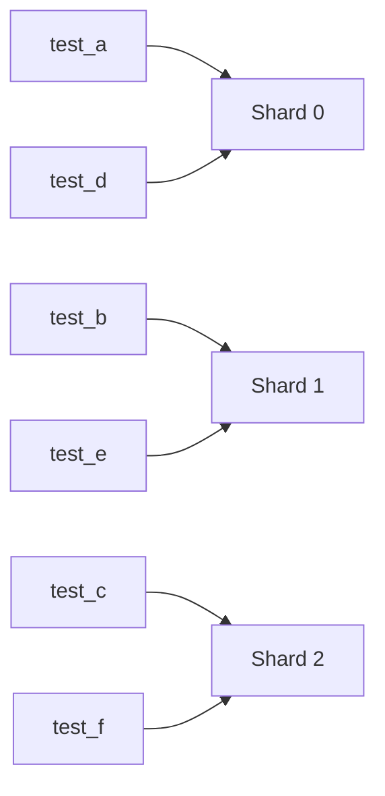
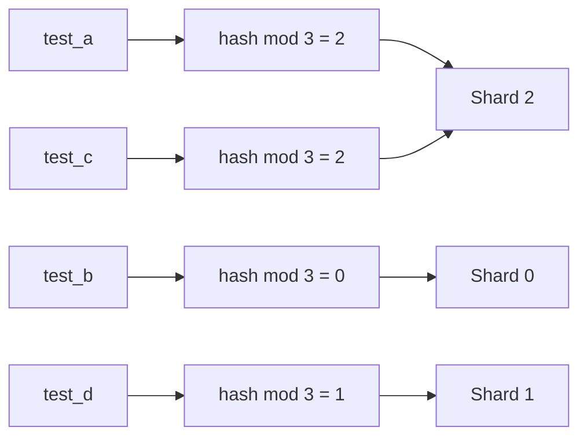
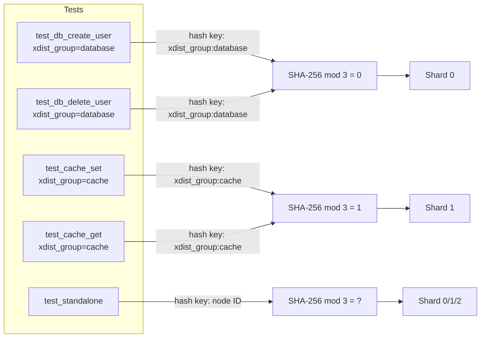
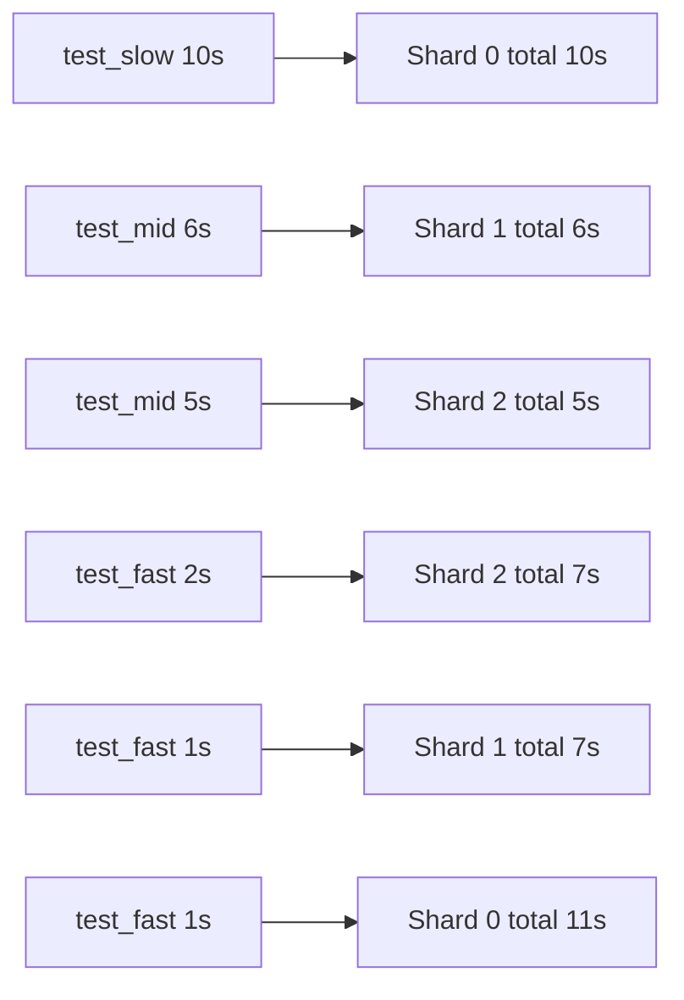

[繁體中文](sharding-modes.zh-TW.md) | **English**

# Sharding Modes

This guide explains how each `pytest-shard` mode behaves, how to generate `.test_durations`, and when to choose each strategy.

## Available modes

Three modes are available via `--shard-mode`:

### `roundrobin` (default)

Tests are sorted by node ID and distributed by index:

```
shard_id = index_in_sorted_list % num_shards
```



- Shard sizes differ by **at most 1** regardless of test count.
- Deterministic per run, but adding or removing tests shifts the assignment of other tests.

### `hash`

```
shard_id = SHA-256(test_node_id) % num_shards
```



- Each test's assignment is **stable in isolation** — adding or removing other tests never changes where an existing test lands.
- Stateless, no extra files needed.
- Distribution may be uneven for small test counts.

#### xdist_group co-location guarantee

In `hash` mode, if a test carries the `@pytest.mark.xdist_group` marker (from [pytest-xdist](https://github.com/pytest-dev/pytest-xdist)), **all tests sharing the same group name are guaranteed to land on the same shard**. The hash key becomes `xdist_group:<name>` instead of the individual node ID.

This lets you express co-location intent that works at two levels simultaneously: pytest-xdist ensures co-location within a single machine, and pytest-shard ensures co-location across CI workers.

**Example:**

```python
import pytest

@pytest.mark.xdist_group("db_setup")
def test_create_user(): ...

@pytest.mark.xdist_group("db_setup")
def test_delete_user(): ...  # guaranteed same shard as test_create_user
```

Both marker forms are supported:

```python
@pytest.mark.xdist_group("db_setup")          # positional
@pytest.mark.xdist_group(name="db_setup")     # keyword — identical effect
```

**Hash routing diagram with xdist_group:**



**Behavior summary:**

| Condition | Hash key | Behavior |
|-----------|----------|----------|
| No `xdist_group` | `test_node_id` | Same as before (regression-safe) |
| `xdist_group("name")` | `xdist_group:name` | All group members → same shard |
| `xdist_group(name="name")` | `xdist_group:name` | Same as above |
| `xdist_group` with empty name | `test_node_id` | Falls back to node ID |
| `roundrobin` or `duration` mode | — | Not affected by `xdist_group` |

**Group size warning:**

If a single `xdist_group` accounts for more than 50% of the tests on a shard, pytest-shard emits a non-blocking `UserWarning`:

```
UserWarning: xdist_group 'database' accounts for 8/10 tests (80%) in this shard,
which may cause uneven shard sizes.
```

This is expected when groups are large relative to the total test count. It is informational only and does not block the test run.

**Demo (Allure Timeline proof):**

Run the bundled demo to see the grouping in action:

```bash
nox -s demo-xdist-group-hash
allure open allure-report-xdist-group
```

Navigate to **Timeline** in the left sidebar. All tests with the same `xdist_group` appear on the same thread (shard process):


The demo runs 17 tests across 3 shards:

| Shard | Groups assigned | Test count |
|-------|----------------|-----------|
| 0 | `database` (5) + `auth` (4) + 1 standalone | 10 |
| 1 | `cache` (4) + 1 standalone | 5 |
| 2 | 2 standalone | 2 |

Every test inside `database` lands on shard 0. Every test inside `cache` lands on shard 1. No group is ever split across shards.

### `duration`

Uses a `.test_durations` JSON file (compatible with [pytest-split](https://github.com/jerry-git/pytest-split)) mapping node IDs to seconds:

```json
{
  "tests/test_foo.py::test_slow": 4.2,
  "tests/test_foo.py::test_fast": 0.1
}
```

Tests are assigned using the **Longest Processing Time (LPT)** greedy algorithm: sort by duration descending, then place each test into the shard with the smallest accumulated time. Tests with no recorded duration default to 1.0 s.



## Recording `.test_durations`

Use `--store-durations` to record each test's call-phase duration and write it at session end:

```bash
# Write to .test_durations in the current directory
pytest tests --store-durations

# Write to a custom path
pytest tests --store-durations --durations-path=artifacts/test_durations.json
```

- `--store-durations` enables duration recording for the current run.
- `--durations-path=PATH` controls where the JSON file is written or read from. The default is `.test_durations`.
- Existing entries in the file are preserved; tests executed in the current run overwrite only their own entries.
- When running shards in parallel, each shard should write to its own file, then you merge them before using `--shard-mode=duration`.

## Verbose shard report

By default, pytest prints a one-line summary at collection time:

```
Running 7 items in this shard (mode: roundrobin)
```

Pass `-v` to also list every test node ID assigned to this shard:

```
Running 7 items in this shard (mode: roundrobin): tests/test_foo.py::test_a, ...
```

## Duration mode prerequisite

`--shard-mode=duration` requires the file pointed to by `--durations-path` to already exist.
If the file is missing, run a normal test pass with `--store-durations` first, for example:

```bash
pytest tests --store-durations --durations-path=.test_durations
pytest tests --shard-mode=duration --durations-path=.test_durations --num-shards=3 --shard-id=0
```

### `hash-balanced`

```
Groups (tests with xdist_group) → LPT bin-packing by group size
Ungrouped tests                 → SHA-256(node_id) % num_shards
```

Plain `hash` mode assigns every group by `SHA-256("xdist_group:<name>") % N`. When multiple large groups happen to hash to the same shard, that shard becomes overloaded while others stay nearly empty.

`hash-balanced` replaces the per-group hash with **LPT (Longest Processing Time) bin-packing** at the group level:

1. Separate items into groups (have `xdist_group`) and ungrouped.
2. Sort groups by size **descending**, group name **ascending** as tiebreaker.
3. Assign each group greedily to the shard with the fewest tests so far.
4. Assign ungrouped items via `SHA-256(node_id) % num_shards` (same as plain hash).

**Determinism guarantee:** the sort key and the greedy selection are both fully deterministic. Every pod independently computes the same global assignment table from the same test collection — no inter-process coordination is needed, and there is no risk of overlap or gaps.

**Example — same 17 tests, plain `hash` vs `hash-balanced` (3 shards):**

| Mode | Shard 0 | Shard 1 | Shard 2 |
|------|---------|---------|---------|
| `hash` | database(5) + auth(4) + 1 standalone = **10** | cache(4) + 1 standalone = 5 | 2 standalone = 2 |
| `hash-balanced` | database(5) + 1 standalone = **6** | auth(4) + 1 standalone = 5 | cache(4) + 2 standalone = **6** |

`hash-balanced` prevents `database` and `auth` from colliding on shard 0 and distributes load evenly.

**Demo (Allure Timeline):**

```bash
nox -s demo-xdist-group-hash-balanced
allure open allure-report-xdist-group-balanced
```

**Trade-offs vs plain `hash`:**

| Property | `hash` | `hash-balanced` |
|----------|--------|-----------------|
| Stateless (per-test stable) | ✓ | ✗ (depends on all groups in collection) |
| Deterministic for same collection | ✓ | ✓ |
| Prevents group collision | ✗ | ✓ |
| Groups stay together | ✓ | ✓ |
| Needs no extra data | ✓ | ✓ |

---

## Mode comparison

| Mode | Count balance | Time balance | Needs data file | Per-test stable | xdist_group support |
|------|:---:|:---:|:---:|:---:|:---:|
| `roundrobin` | ✓ (exact) | — | — | — | — |
| `hash` | △ (small N) | — | — | ✓ | ✓ co-location |
| `hash-balanced` | ✓ (group-level) | — | — | — | ✓ co-location + no collision |
| `duration` | — | ✓ (optimal) | ✓ | — | — |

## Which mode should you choose?

- Choose `roundrobin` when you want the safest default and roughly equal test counts across shards.
- Choose `hash` when per-test assignment stability matters more than perfectly even shard sizes — adding or removing tests elsewhere never changes where an existing test lands. Use `@pytest.mark.xdist_group` to co-locate tests that share state.
- Choose `hash-balanced` when you use `xdist_group` and want to prevent multiple large groups from colliding on the same shard. Assignment is still deterministic for the same collection, so independent pods (e.g., separate CI pods) always compute the same result without coordination.
- Choose `duration` when test runtimes vary a lot and total wall-clock time matters more than equal test counts. This is usually the best option for mature CI pipelines once you have a valid `.test_durations` file.
