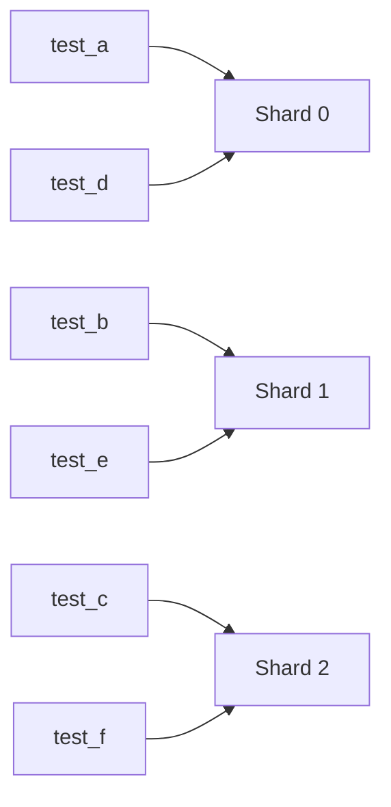
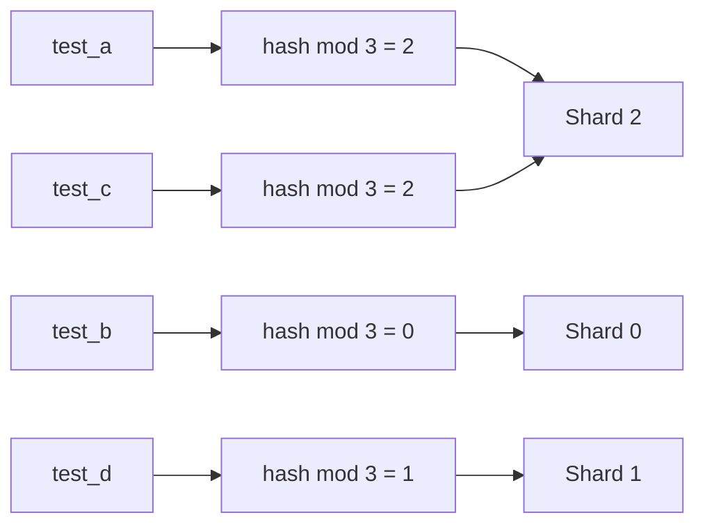
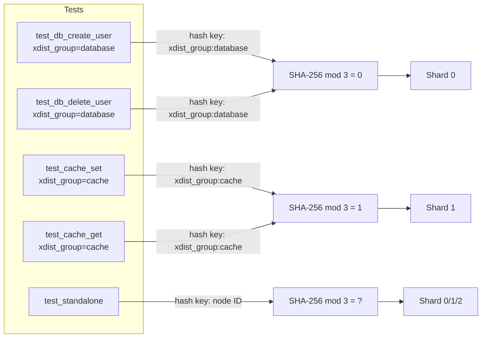
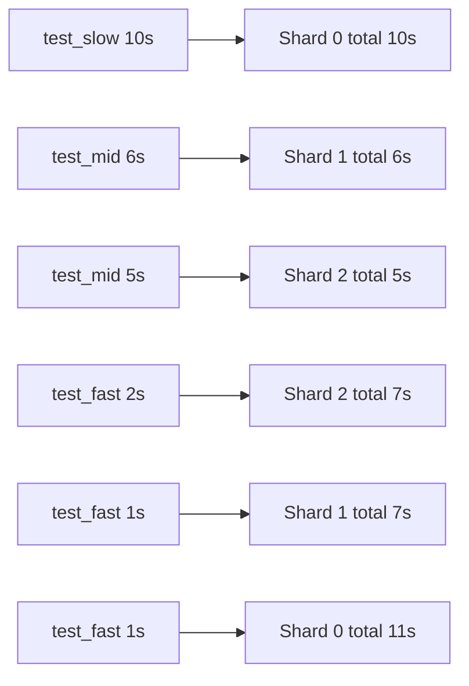

**繁體中文** | [English](sharding-modes.md)

# 分派模式

本指南說明 `pytest-shard` 各種 `--shard-mode` 的行為、如何產生 `.test_durations`，以及實務上該如何選擇模式。

## 可用模式

透過 `--shard-mode` 可選擇三種模式：

### `roundrobin`（預設）

將測試依 node ID 排序後，以索引輪流分配：

```
shard_id = 排序後的索引 % num_shards
```



- 各 shard 的測試數量差距**不超過 1**，無論測試總數為何。
- 每次執行確定性，但新增或移除測試時，其他測試的分配可能隨著排序順序改變。

### `hash`

```
shard_id = SHA-256(test_node_id) % num_shards
```



- 每個測試的歸屬**獨立穩定**，新增或移除其他測試不影響既有測試的分配。
- 無狀態，不需要額外檔案。
- 測試數量較少時分配可能不均。

#### xdist_group 同 shard 保證

在 `hash` 模式下，若測試帶有 `@pytest.mark.xdist_group` marker（由 [pytest-xdist](https://github.com/pytest-dev/pytest-xdist) 提供），**所有具有相同 group 名稱的測試都保證落在同一個 shard**。hash 鍵由個別的 node ID 改為 `xdist_group:<name>`。

這讓你可以用同一個 marker 同時表達兩個層級的共置意圖：pytest-xdist 確保在單台機器內同一個 worker 執行，pytest-shard 確保跨 CI worker 時分到同一個 shard。

**使用範例：**

```python
import pytest

@pytest.mark.xdist_group("db_setup")
def test_create_user(): ...

@pytest.mark.xdist_group("db_setup")
def test_delete_user(): ...  # 保證與 test_create_user 落在同一 shard
```

兩種 marker 寫法均支援：

```python
@pytest.mark.xdist_group("db_setup")          # 位置參數
@pytest.mark.xdist_group(name="db_setup")     # keyword 參數，效果相同
```

**含 xdist_group 的 hash 路由示意：**



**行為總覽：**

| 情境 | Hash 鍵 | 效果 |
|------|---------|------|
| 無 `xdist_group` | `test_node_id` | 行為與舊版完全相同（regression-safe） |
| `xdist_group("name")` | `xdist_group:name` | 同 group 的測試 → 同一 shard |
| `xdist_group(name="name")` | `xdist_group:name` | 同上 |
| `xdist_group` 但 name 為空字串 | `test_node_id` | fallback 到 node ID |
| `roundrobin` 或 `duration` 模式 | — | 不受 `xdist_group` 影響 |

**Group 大小警告：**

若某個 `xdist_group` 在某 shard 的測試佔比超過 50%，pytest-shard 會發出非阻斷性 `UserWarning`：

```
UserWarning: xdist_group 'database' accounts for 8/10 tests (80%) in this shard,
which may cause uneven shard sizes.
```

這是預期行為，當 group 相對於測試總數較大時就會出現。此訊息僅供參考，不會中斷測試執行。

**Demo（Allure Timeline 驗證）：**

執行內建 demo 即可親眼確認分組效果：

```bash
nox -s demo-xdist-group-hash
allure open allure-report-xdist-group
```

在左側選單點選 **Timeline**，即可看到相同 `xdist_group` 的測試都出現在同一條執行緒（同一個 shard 程序）上：


此 demo 共 17 個測試分配至 3 個 shard：

| Shard | 分配的 group | 測試數量 |
|-------|-------------|---------|
| 0 | `database`（5）+ `auth`（4）+ 1 個 standalone | 10 |
| 1 | `cache`（4）+ 1 個 standalone | 5 |
| 2 | 2 個 standalone | 2 |

`database` 的所有測試落在 shard 0，`cache` 的所有測試落在 shard 1，任何 group 都不會被分割到不同 shard。

### `duration`

使用 `.test_durations` JSON 檔案（與 [pytest-split](https://github.com/jerry-git/pytest-split) 格式相容），記錄每個 node ID 的執行時間（秒）：

```json
{
  "tests/test_foo.py::test_slow": 4.2,
  "tests/test_foo.py::test_fast": 0.1
}
```

採用**最長工作優先（LPT）**貪婪演算法：依執行時間由長到短排序，依序分配給當前累計時間最短的 shard。沒有紀錄的測試預設為 1.0 秒。



## 產生 `.test_durations`

使用 `--store-durations` 可記錄每個測試在 call phase 的執行時間，並在 session 結束時寫入檔案：

```bash
# 寫入目前目錄下的 .test_durations
pytest tests --store-durations

# 指定自訂輸出路徑
pytest tests --store-durations --durations-path=artifacts/test_durations.json
```

- `--store-durations` 會為本次執行啟用 duration 記錄。
- `--durations-path=PATH` 用來控制 JSON 檔案的讀寫位置；預設是 `.test_durations`。
- 檔案中原有的紀錄會保留；本次執行到的測試只會覆寫自己的項目。
- 如果是平行 shard 執行，建議每個 shard 先寫到各自的檔案，再合併後給 `--shard-mode=duration` 使用。

## Verbose shard 報告

預設情況下，pytest 會在收集階段印出一行摘要：

```
Running 7 items in this shard (mode: roundrobin)
```

加上 `-v` 後，會額外列出該 shard 分配到的所有測試 node ID：

```
Running 7 items in this shard (mode: roundrobin): tests/test_foo.py::test_a, ...
```

## Duration 模式的前置條件

`--shard-mode=duration` 需要 `--durations-path` 指向的檔案事先存在。
如果檔案不存在，請先用 `--store-durations` 跑一次一般測試，例如：

```bash
pytest tests --store-durations --durations-path=.test_durations
pytest tests --shard-mode=duration --durations-path=.test_durations --num-shards=3 --shard-id=0
```

### `hash-balanced`

```
有 xdist_group 的測試  → 依 group 大小做 LPT bin-packing
無 xdist_group 的測試  → SHA-256(node_id) % num_shards
```

純 `hash` 模式對每個 group 計算 `SHA-256("xdist_group:<name>") % N`。當多個大型 group 碰巧 hash 到同一個 shard 時，該 shard 會過載，其他 shard 卻幾乎沒有工作。

`hash-balanced` 將 group 層級的 hash 替換為 **LPT（最長工作優先）bin-packing**：

1. 將所有測試分成「有 xdist_group」與「無 xdist_group」兩類。
2. 依 group 大小**降序**排序，大小相同時再依 group 名稱**升序**排序（作為 tiebreaker）。
3. 依序將每個 group 分配到目前測試數量最少的 shard（貪婪策略）。
4. 無 group 的測試維持 `SHA-256(node_id) % num_shards` 分配（同純 hash 模式）。

**確定性保證：** 排序鍵與貪婪選擇均完全確定。每個 pod 從相同的測試集獨立計算出相同的全域分配表，不需要跨程序協調，不會有重疊或遺漏。

**範例 — 同樣 17 個測試，`hash` vs `hash-balanced`（3 個 shard）：**

| 模式 | Shard 0 | Shard 1 | Shard 2 |
|------|---------|---------|---------|
| `hash` | database(5) + auth(4) + 1 standalone = **10** | cache(4) + 1 standalone = 5 | 2 standalone = 2 |
| `hash-balanced` | database(5) + 1 standalone = **6** | auth(4) + 1 standalone = 5 | cache(4) + 2 standalone = **6** |

`hash-balanced` 避免了 `database` 和 `auth` 碰撞到 shard 0，實現均勻的負載分配。

**Demo（Allure Timeline）：**

```bash
nox -s demo-xdist-group-hash-balanced
allure open allure-report-xdist-group-balanced
```

**與純 `hash` 的比較：**

| 特性 | `hash` | `hash-balanced` |
|------|--------|-----------------|
| Stateless（每測試穩定） | ✓ | ✗（取決於集合中所有 group） |
| 相同集合結果確定 | ✓ | ✓ |
| 避免 group 碰撞 | ✗ | ✓ |
| 同 group 必在同 shard | ✓ | ✓ |
| 不需額外資料檔 | ✓ | ✓ |

---

## 模式比較

| 模式 | 數量平衡 | 時間平衡 | 需要資料檔 | 每測試穩定 | xdist_group 支援 |
|------|:---:|:---:|:---:|:---:|:---:|
| `roundrobin` | ✓（精確） | — | — | — | — |
| `hash` | △（小樣本） | — | — | ✓ | ✓ 同 shard |
| `hash-balanced` | ✓（group 層級） | — | — | — | ✓ 同 shard + 不碰撞 |
| `duration` | — | ✓（最佳化） | ✓ | — | — |

## 該選哪一種模式？

- 如果你想要最穩妥的預設行為，並希望各 shard 的測試數量大致平均，選 `roundrobin`。
- 如果你更在意每個測試的分配穩定性，例如希望測試集增減時某個既有測試仍留在同一個 shard，選 `hash`。可搭配 `@pytest.mark.xdist_group` 確保需要共用狀態的測試落在同一 shard。
- 如果你使用 `xdist_group`，且希望避免多個大型 group 碰撞到同一個 shard，選 `hash-balanced`。相同測試集的分配結果具有確定性，各個獨立 pod（例如 CI 中分開執行的容器）可以在不互相協調的前提下算出完全一致的結果。
- 如果測試執行時間差異很大，而且你更在意整體 wall-clock time 而不是每個 shard 的測試數量，選 `duration`。在成熟的 CI pipeline 中，只要你已有有效的 `.test_durations` 檔案，通常這會是最佳選項。
